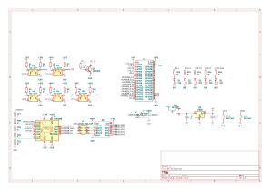

# BIT3_PCB

KiCad 7.0.x にて設計

# BIT とは

**B**eginning **I**.Sys **T**racer のイニシャルで、新入生教育用のライントレーサの筐体です  
先代の BIT2 の設計を踏襲しつつ、マイコンを RP2040 搭載の秋月製 AE-2040 に置き換えました。ギアボックス等は流用できるようにしています

# 部品表

| 部品番号 | 部品名 | 秋月 |
|:----|:----|:----|
| R1 - R5, R12 - R16 | 510 Ω | [R-25511](https://akizukidenshi.com/catalog/g/gR-25511/) |
| R6 - R10 | 75 Ω | [R-25750](https://akizukidenshi.com/catalog/g/gR-25750/) |
| R11、R17 - R21 | 1k Ω | [R-25102](https://akizukidenshi.com/catalog/g/gR-25102/) |
| C1, C2 | 0.1 uF | [P-10147](https://akizukidenshi.com/catalog/g/gP-10147/) |
| U1 | AE-RP2040 | [K-17542](https://akizukidenshi.com/catalog/g/gK-17542/) |
| U2 - U6 | TPR-105F | [I-12626](https://akizukidenshi.com/catalog/g/gI-12626/) |
| U7 | MCP3008 | [I-09485](https://akizukidenshi.com/catalog/g/gI-09485/) |
| U8 | AE-DRV8835 | [K-09848](https://akizukidenshi.com/catalog/g/gK-09848/) |
| U9 | NJM7805FA | [I-08678](https://akizukidenshi.com/catalog/g/gI-08678/) |
| Q1 | 2SC1815 | [I-17089](https://akizukidenshi.com/catalog/g/gI-17089/) |
| F1 | リセッタブルヒューズ | [P-12632](https://akizukidenshi.com/catalog/g/gP-12632/) |
| SW1, SW2 | タクタイルスイッチ | [P-03647](https://akizukidenshi.com/catalog/g/gP-03647/) |
| J1, J2 | 2 列ピンヘッダ | [C-00080](https://akizukidenshi.com/catalog/g/gC-00080/) |

# 回路図

# 更新履歴

- `v1.0`
  - 初回リリース
- `v1.1`
  - ADC にバッテリ電圧が直接入力される問題を修正
- `v1.2`
  - 接続されていない GND ベタが存在する問題を修正
- `v1.3`
  - モータ・ドライバに電源が供給されていない問題を修正
