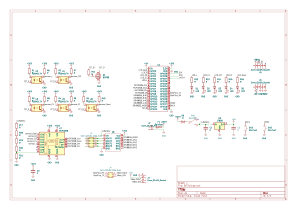
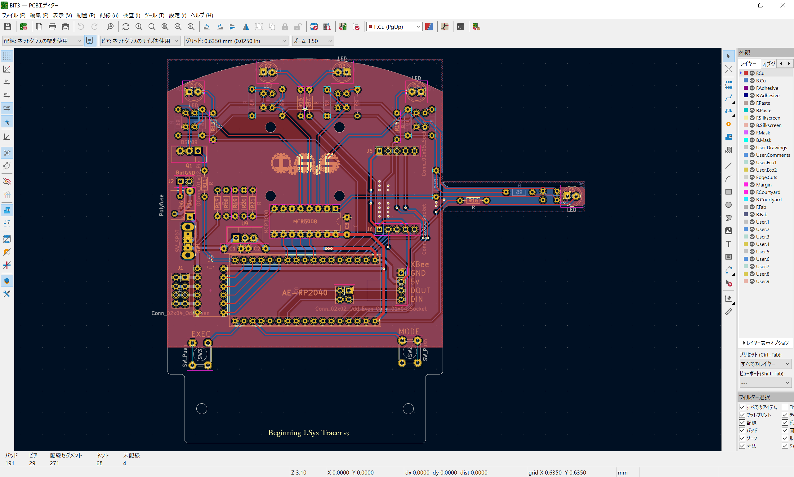

# BIT3_PCB

KiCad 7.0.x にて設計

# BIT とは

**B**eginning **I**.Sys **T**racer のイニシャルで、新入生教育用のライントレーサの筐体です  
先代の BIT2 の設計を踏襲しつつ、マイコンを RP2040 搭載の秋月製 AE-2040 に置き換えました。ギアボックス等は流用できるようにしています

# 部品表

## 主要部品

| 部品番号 | 部品名 | 秋月 |
|:----|:----|:----|
| R1 - R5, R11 | 100 Ω | [125101](https://akizukidenshi.com/catalog/g/125101/) |
| R6 - R10 | 47 k Ω | [125473](https://akizukidenshi.com/catalog/g/125473/) |
| R12 - R16 | 510 Ω | [125511](https://akizukidenshi.com/catalog/g/125511/) |
| R17 - R21 | 1k Ω | [125102](https://akizukidenshi.com/catalog/g/125102/) |
| C1 - C3 | 0.1 uF | [110147](https://akizukidenshi.com/catalog/g/110147/) |
| D1 - D5 | 5mm LED | [113172](https://akizukidenshi.com/catalog/g/113172/) |
| D6 | 1N4148 | [100941](https://akizukidenshi.com/catalog/g/100941/) |
| U1 | AE-RP2040 | [117542](https://akizukidenshi.com/catalog/g/117542/) |
| U2 - U6 | LBR-127HLD | [104500](https://akizukidenshi.com/catalog/g/104500/) |
| U7 | MCP3008 | [109485](https://akizukidenshi.com/catalog/g/109485/) |
| U7 | IC ソケット | [100007](https://akizukidenshi.com/catalog/g/100007/) |
| U8 | AE-DRV8835 | [109848](https://akizukidenshi.com/catalog/g/109848/) |
| U9 | NJM7805FA | [108678](https://akizukidenshi.com/catalog/g/108678/) |
| Q1 | Nch MOSFET | [107597](https://akizukidenshi.com/catalog/g/107597/) |
| F1 | リセッタブルヒューズ | [P-12628](https://akizukidenshi.com/catalog/g/112628/) |
| SW1 | 電源スイッチ | [100300](https://akizukidenshi.com/catalog/g/100300/) |
| EXEC, MODE | タクタイルスイッチ | [P-03647](https://akizukidenshi.com/catalog/g/103647/) |
| J1 | 2 列ピンヘッダ | [100080](https://akizukidenshi.com/catalog/g/100080/) |
| J2 | バッテリ接続用ケーブル・コネクタ | 省略 |
| J3, U1 | 1 列ピンソケット | [105779](https://akizukidenshi.com/catalog/g/105779/) |

## その他の部品

| 部品名 | 商品名 | リンク |
|:----|:----|:----|
| 前輪 | タミヤ　ボールキャスター | <https://tamiyashop.jp/shop/g/g70144> |
| 動力 | タミヤ　ダブルギヤボックス（左右独立4速タイプ） | <https://tamiyashop.jp/shop/g/g70168> |
| 後輪 | タミヤ　スリムタイヤセット | <https://tamiyashop.jp/shop/g/g70193> |
| XBee | XBee S2C ワイヤアンテナ型 | <https://www.switch-science.com/products/4089> |
| XBee 用変換基板 | XBeeエクスプローラ5Vマイコン用 | <https://www.switch-science.com/products/1166> |
| XBee 用 USB アダプタ | XBeeエクスプローラUSBドングル | <https://www.switch-science.com/products/1790> |

# 回路図

# 基板デザイン

# 更新履歴

- `v1.0`
  - 初回リリース
- `v1.1`
  - ADC にバッテリ電圧が直接入力される問題を修正
- `v1.2`
  - 接続されていない GND ベタが存在する問題を修正
- `v1.3`
  - モータ・ドライバに電源が供給されていない問題を修正
- `v1.4`
  - ADC IC MCP3008 にパスコンを追加
- `v1.5` 
  - 前輪と部品が微妙に干渉する問題を修正
- `v1.6`
  - 逆接防止ダイオードの追加、バッテリ入力の接続の変更、一部部品の変更（基板には影響なし）
- `v1.7`
  - フォトセンサを変更
- `v2.0`
  - XBee 接続用のコネクタを追加
- `v2.1`
  - BACK を EXEC に変更
- `v2.2`
  -  フォトセンサ駆動用トランジスタを変更

# ライセンス

 この 作品 は <a rel="license" href="http://creativecommons.org/licenses/by-nc-nd/4.0/">クリエイティブ・コモンズ 表示 - 非営利 - 改変禁止 4.0 国際 ライセンス</a>の下に提供されています。

利用を希望される方は部の[公式 Twitter ](https://twitter.com/ISys_robocon)までご連絡ください
